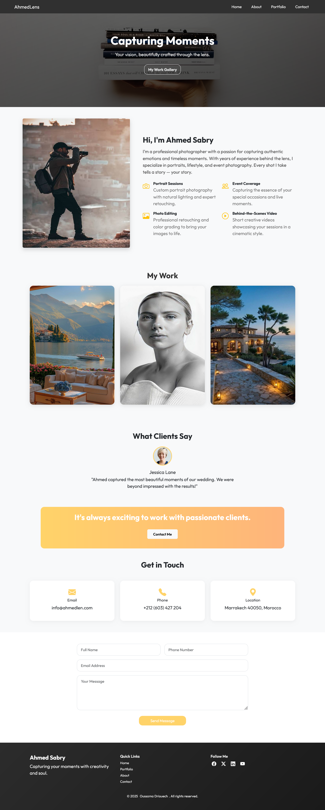

# 📸 AhmedLens — Photographer Portfolio Website

A modern, responsive, and visually stunning portfolio website tailored for photographers and creatives. Built with **HTML5**, **Bootstrap 5**, **CSS3**, and **JavaScript**, this site showcases your work, services, and client feedback with a sleek user experience.

---

## 🚀 Features

- ✅ Fully responsive layout (mobile/tablet/desktop)
- ✅ Hero section with bold intro and call-to-action
- ✅ About section with photo, story, and services
- ✅ Interactive photo gallery with hover effects
- ✅ Gradient contact form and social media icons
- ✅ Footer and themed UI with modern design elements

---

## 📷 Preview

 

---

## 🛠️ Tech Stack

- **HTML5**
- **Bootstrap 5**
- **CSS3** (custom + Bootstrap utility)
- **JavaScript** 
- **Bootstrap Icons** (used for contact & social)

